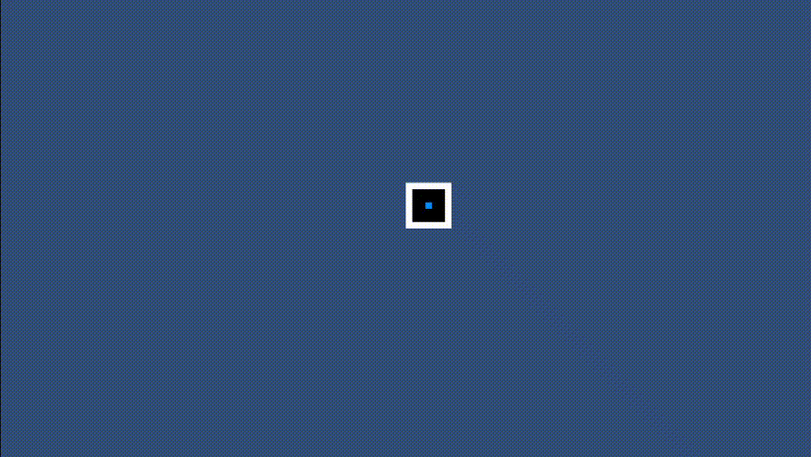

# Procedural-Dungeon-Generator

Hello, this is a procedural dungeon generator with similar rules to The Binding of Isaac ones.

  

This dungeon generator uses the [drunkard's walk](https://en.wikipedia.org/wiki/Random_walk) algorithm to draw aleatory rooms, the spawn room and the boss room in a Tile Map.

You can see the scripts [here](https://github.com/rgferrari/Procedural-Dungeon-Generator/tree/master/Assets/Scripts).
